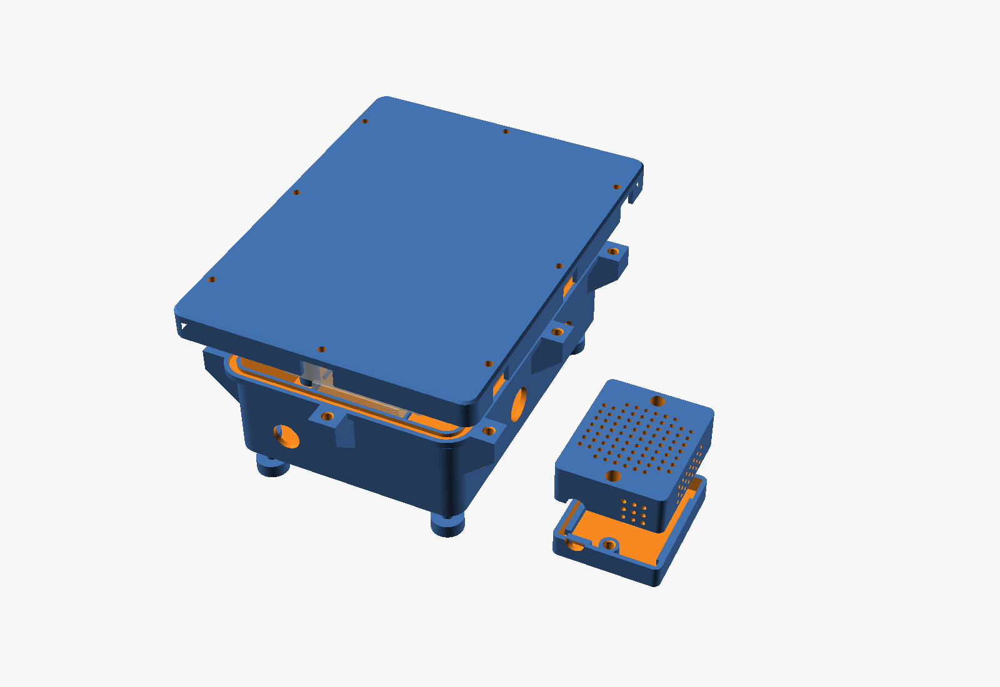
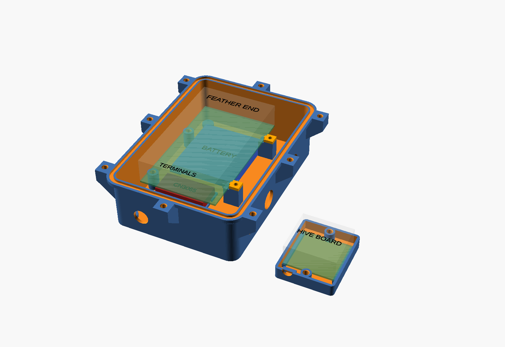
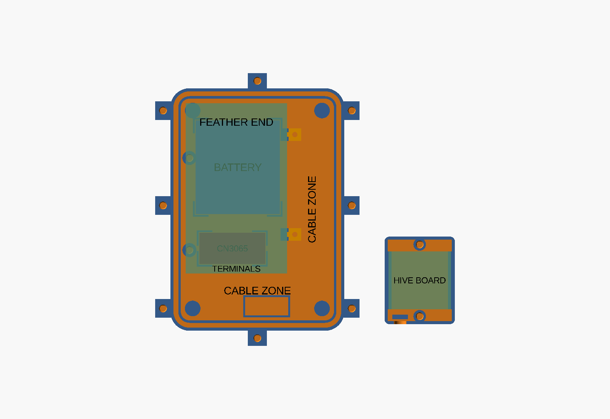
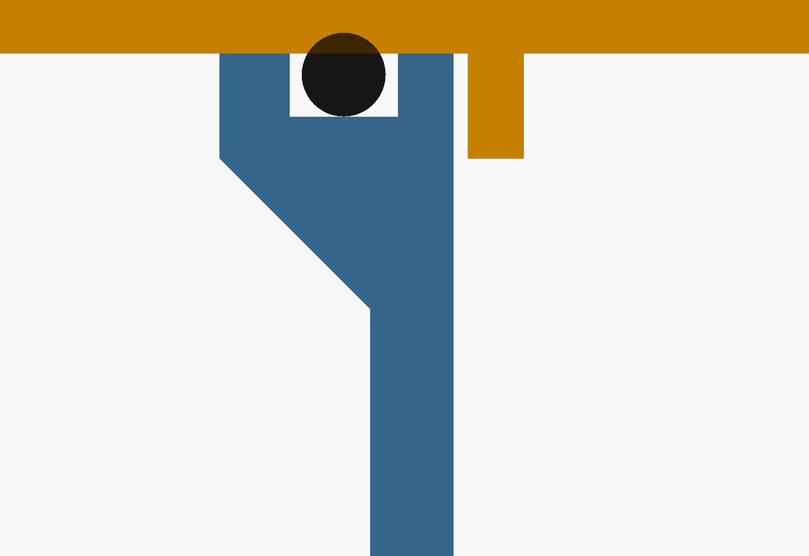
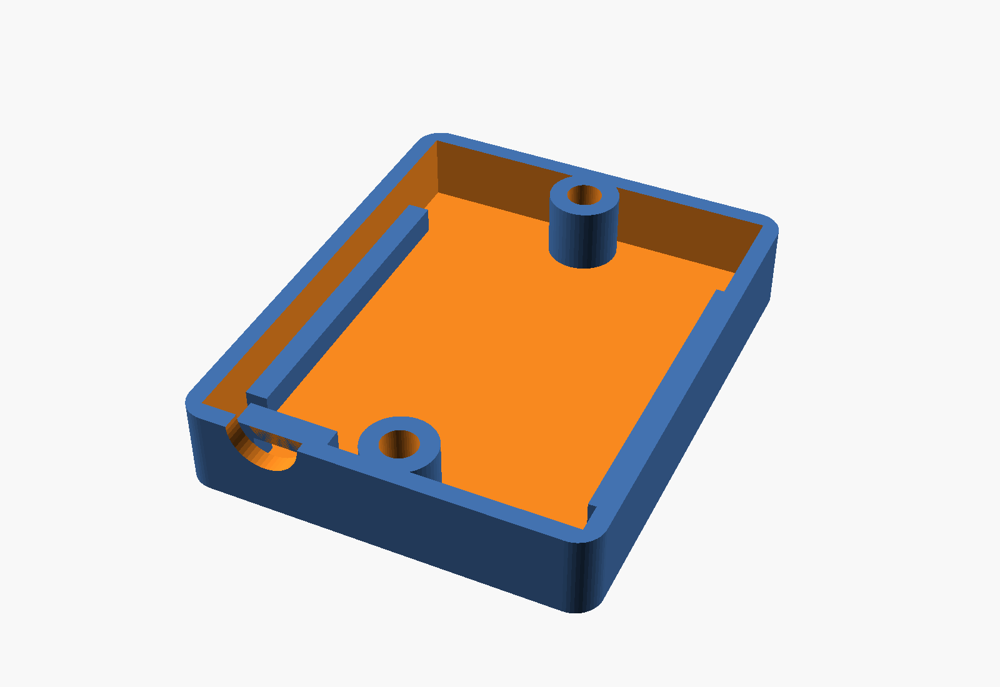
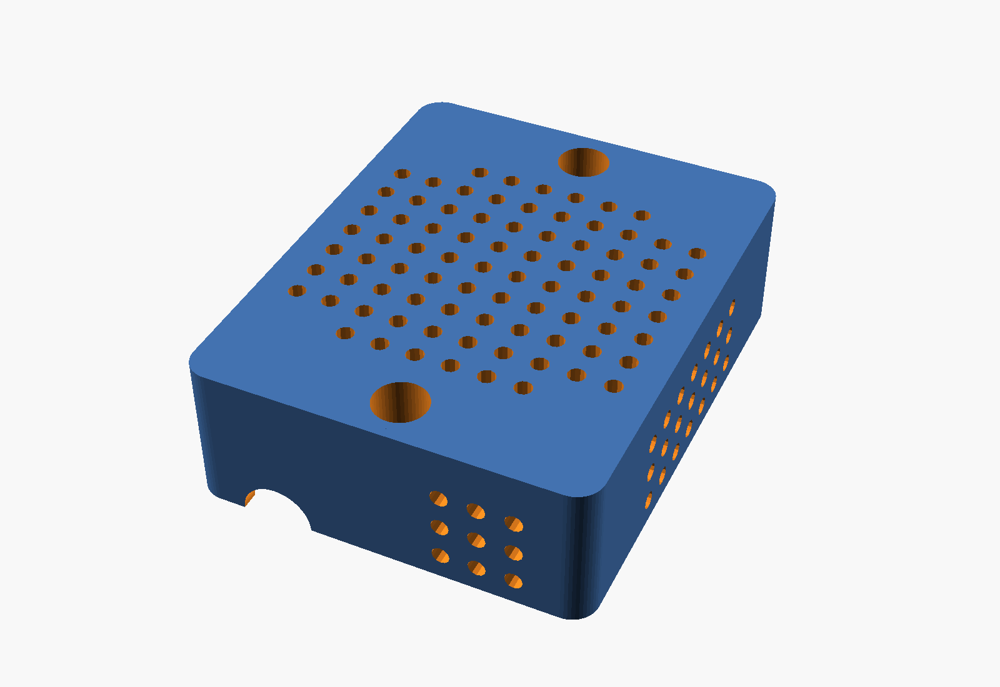

# ESP32 Beehive Monitor

A battery-powered beehive monitoring system built with ESPHome. Uses FFT-based
audio analysis to detect colony health indicators, along with weight,
temperature, and humidity monitoring.

## Features

- **Audio Analysis**: FFT-based frequency band monitoring to detect queen
  piping, queenless conditions, and pre-swarm behaviour
- **Weight Monitoring**: Track hive weight changes using 4x 50kg load cells via
  NAU7802 ADC
- **Environmental Sensing**: Temperature and humidity via SHT40 sensor
- **Power Monitoring**: Solar current, voltage and power via INA226; battery voltage
  and state of charge via the FeatherS3D's onboard MAX17048 fuel gauge
- **Battery Optimised**: Deep sleep between 5-minute measurement cycles
- **Home Assistant Integration**: Automatic sensor discovery and state reporting

## Hardware Requirements

| Component | Description | Qty |
| ----------- | ------------- | ----- |
| [FeatherS3D](https://unexpectedmaker.com/feathers3d) (ESP32-S3) | Main microcontroller | 1 |
| INMP441 | I2S MEMS microphone (GPIO1, 3, 7) | 1 |
| [Adafruit NAU7802](https://www.adafruit.com/product/4538) | 24-bit ADC breakout | 1 |
| 50kg Load Cells | Half-bridge strain gauges | 4 |
| SHT40 | Temperature/humidity sensor | 1 |
| INA226 | Solar current/voltage/power monitor | 1 |
| CN3065 | Solar LiPo charge controller | 1 |
| [3.7V 2000mAh LiPo](https://core-electronics.com.au/polymer-lithium-ion-battery-2000mah-38459.html) | Battery (DW01+ PCM) | 1 |
| Solar panel | 6V nominal, 1W or larger (CN3065 input is rated for 6V panels) | 1 |
| Stripboard 24 x 41 holes | Main board (under the bottom board) | 1 |
| Stripboard 16 x 15 holes | Hive board (inside the brood box) | 1 |
| JST-XH 8-way socket and cable | Hive cable, one socket per board | 2 sockets, 1 cable |
| JST-XH 12-way socket and cable | Load cell socket (J_CELLS) | 1 |
| JST-XH 2-way socket | Solar in, charger in, charger out | 3 |
| JST-PH 2-way pigtail | CN3065 solar and output sockets | 2 |
| 100 nF ceramic capacitor | C2, C3 | 2 |
| 470 µF 6.3 V electrolytic capacitor | C1 | 1 |

## Power Architecture

The battery is charged by the CN3065 solar charge controller. An INA226 sits
high-side between the solar panel and the CN3065 solar input. The battery connects
directly to the CN3065 battery terminal.

The CN3065 output feeds the FeatherS3D's **VBAT pin**, so the board's own LDO
regulates 3.3V. Feeding the 3.3V pin instead would leave LDO2 unpowered, as its
input is the VBAT/USB node rather than the 3.3V rail.

The FeatherS3D's onboard charger only has power while USB is plugged in, so in the
field the CN3065 is the only charger. On USB, both chargers are 4.2V CC/CV parts and
share the cell harmlessly, with the DW01+ PCM as a backstop.

Battery voltage and state of charge come from the FeatherS3D's onboard MAX17048 fuel
gauge (I2C 0x36), which sees the cell via the VBAT pin. It sits on the always-on
LDO1 rail, so its ModelGauge state survives deep sleep.

The FeatherS3D's **LDO2** (GPIO39) provides a switchable 3.3V rail that is automatically
disabled during deep sleep, used to power-gate sensors that aren't needed during sleep.
All sensors, including the I2C pull-ups on their breakouts, are on this rail.

The INA226 address pins A0 and A1 are left unconnected. The CJMCU-226 module
has 10 kΩ pull-downs on both, which gives address 0x40. Confirm this on your
unit before building: unpowered, A0 to GND and A1 to GND should each read about
10 kΩ. If either reads open, strap that pad to GND.

CJMCU-226 modules come with two header pinouts: after ALE some read SDA then
SCL, others SCL then SDA. The Fritzing part (`fritzing/ina226/`) and the
stripboard layout follow the first, with SDA on pin 5. Check the silkscreen
before soldering the header; if yours is the other variant, do not plug the
module straight into its socket, but cross SDA and SCL with two short flying
leads.

### Solar Performance

The CN3065 regulates its own input voltage. In direct sun it held the panel at
4.77V for over an hour while the current drifted, well below the 6V maximum
power point of a nominal 6V panel. Panel power is therefore capped near 0.8W no
matter how much sun a 1W panel sees.

That cap matters less than it looks. The CN3065 is a linear charger, so it
passes current through roughly one-for-one and burns the voltage difference as
heat. Charge current, not panel watts, is what fills the cell.

Measured on a 110 x 60 mm 1W 6V polycrystalline panel in direct spring sun
(Sydney, sun about 52° above the horizon, panel not aimed):

| Quantity | Value |
|----------|-------|
| Panel voltage | 4.77V (clamped by the CN3065) |
| Panel current | 113-121 mA |
| Panel power | 0.54-0.58W |
| Fraction of nameplate | 55-58% |

At ~113 mA against an average draw of ~2.3 mA, roughly half an hour of direct
sun per day covers the device's entire daily consumption, and four good hours
put in over eight times what it uses. A 1W panel is ample for this load.

Siting buys far more than panel size. The same panel shaded and badly angled
produced 5-50 mW, one to two orders of magnitude below its direct-sun output,
and the battery fell 2.7% per day through it. If the battery is losing ground,
move the panel before buying a bigger one.

If you do want more margin, wire two panels in **parallel** to roughly double
the current at the clamped voltage. Series gains nothing, because the charger
regulates its input down regardless of what the panels could deliver.

### Battery Specifications

| Parameter | Value |
|-----------|-------|
| Nominal voltage | 3.7V |
| Charge voltage | 4.2V (CN3065) |
| Overcharge protection | 4.30V ±0.05V (DW01+ PCM) |
| Over-discharge protection | 2.4V ±0.1V (DW01+ PCM) |
| Capacity | 2000mAh |
| Wiring/connector rating | 1A max |

### I2C Address Map

| Address | Device |
|---------|--------|
| 0x2A | NAU7802 (load cell ADC) |
| 0x36 | MAX17048 fuel gauge (onboard FeatherS3D) |
| 0x40 | INA226 (solar) |
| 0x44 | SHT40 (temperature/humidity) |

## Wiring

The circuit is split across two stripboards joined by a pluggable cable. The
Fritzing sketch `fritzing/BeeHive.fzz` is the design of record and its
breadboard view holds the stripboard layout. Both boards use vertical strips
(strips run top to bottom in the breadboard view) and hole coordinates below
are `(column, row)` counted from 0 at the top-left.

### Boards and Connectors

**Main board** (24 x 41, under the bottom board with the battery, CN3065 and
solar panel plug): FeatherS3D, INA226, NAU7802, C1, C2 and five sockets. The
Feather sits across the top with its 16-pin row on row 3 and 12-pin row on
row 11; every strip under those rows is cut above the top row and below the
bottom row (cuts `x.3v` and `x.10v` for columns 3-18 and 3-14) so the two rows
do not short, except column 15, which carries the Feather GND pin the full
height of the board as the ground rail. Column 2 is the 3.3 V rail, fed from
LDO2 (column 3, row 3) by the jumper on row 2.

Columns 2-9 run straight from the Feather's bottom row to J_HIVE on the bottom
edge (row 40), so 3V3, SDA, SCL, WS, SCK and SD reach the hive socket without a
jumper; columns 5 and 6 (IO33 and IO38, cut at `5.11v 6.11v`) become its two
ground pins via row 14. Everything else sits to the right of that corridor:
C1 and the VBAT tap at the top right, J_PWR on the right edge at row 15, the
INA226 with its header on row 18 (VCC, GND, SCL, SDA, ALE, VBS, IN-, IN+ on
columns 14-21, GND landing on the rail, C2 directly above it on row 17),
J_SOLAR and J_CHG on the right edge at rows 28 and 31, the NAU7802 with its
header on row 29 (DRDY, SDA, SCL, GND, AVDD, VCC on columns 12-17, GND on the
rail, screw terminal facing the bottom edge) and J_CELLS on the bottom edge
beside J_HIVE. Column 23 is a second ground rail for C1 and the three
right-edge sockets; column 22 carries VBAT, panel + and charger + in three
segments. Row 39 stays empty under the two bottom sockets.

| Row | Jumper | Net |
| --- | ------ | --- |
| 2 | (3,2) → (2,2) | LDO2 to the 3.3 V rail |
| 12 | (14,12) → (22,12) | VBAT to C1 and J_PWR |
| 13 | (2,13) → (14,13) | 3.3 V to INA226 VCC and C2 |
| 13 | (15,13) → (23,13) | Ground to the right rail |
| 14 | (15,14) → (6,14) → (5,14) | Ground to J_HIVE pins 4 and 5 |
| 15 | (4,15) → (16,15) | SCL to the INA226 |
| 16 | (3,16) → (13,16) → (17,16) | SDA to the NAU7802 and INA226 |
| 26 | (14,26) → (17,26) | 3.3 V to NAU7802 VCC |
| 26 | (19,26) → (20,26) | INA226 VBS to IN- |
| 26 | (21,26) → (22,26) | INA226 IN+ to J_SOLAR + |
| 27 | (16,27) → (14,27) | SCL to the NAU7802 |
| 33 | (20,33) → (22,33) | INA226 IN- to J_CHG + |
| 38 | (12,38) → (13,38), (15,38) → (16,38), (18,38) → (19,38), (21,38) → (22,38) | Load cell ring, see [Load Cells](#load-cells) |
| 38 | (11,38), (14,38), (17,38), (20,38) | Flying leads into the NAU7802 screw terminal |

**Hive board** (16 x 15, inside the brood box): SHT40, INMP441, C3 and the
cable socket. It is wired up the inside of the hive and unplugs at the main
board.

| Socket | Board, holes | Pin 1 | Pin 2 | Pin 3 | Pin 4 | Pin 5 | Pin 6 | Pin 7 | Pin 8 |
| --- | --- | --- | --- | --- | --- | --- | --- | --- | --- |
| J_HIVE | Main (2-9, 40) | 3V3 | SDA | SCL | GND | GND | WS | SCK | SD |
| J_SUB | Hive (2-9, 1) | 3V3 | SDA | SCL | GND | GND | WS | SCK | SD |
| J_SOLAR | Main (22-23, 28) | Panel + | Panel - | | | | | | |
| J_CHG | Main (22-23, 31) | CN3065 SOLAR + | CN3065 SOLAR - | | | | | | |
| J_PWR | Main (22-23, 15) | CN3065 OUT + | CN3065 OUT - | | | | | | |
| J_CELLS | Main (11-22, 40) | 12 pins, see [Load Cells](#load-cells) | | | | | | | |

The hive cable is wired pin for pin. Ground sits between SCL and the I2S
clocks so the cable can run a metre or two. JST-XH is 2.5 mm pitch, which
fits the 2.54 mm stripboard grid with a little lean on the 8-way socket and
about half a millimetre over the 12-way. Every socket sits on a board edge, so
side-entry (S*B-XH-A) or top-entry (B*B-XH-A) housings both work.

The CN3065 module is not on the stripboard. Its three JST-PH sockets take the
panel current from J_CHG (after the INA226 shunt), the battery directly, and
send the output to J_PWR via short pigtails. The INA226 address pads A0 and A1
are left open; the module pulls them down (see Power Architecture).

Strip cuts on the main board beyond the Feather rows: `5.11v 6.11v` turn the
IO33 and IO38 strips into the J_HIVE grounds, `14.12v` separates VBAT from the
3.3 V segment that feeds the INA226, `13.15v 16.14v 17.15v` keep the SDA and
SCL taps off the Feather pins and pads above them, `17.25v 14.26v 16.27v
12.28v` split the INA226 columns from the NAU7802 header (VCC, SCL, AVDD and
DRDY), `22.15v 22.29v` divide column 22 into VBAT, panel + and charger +, and
`11.37v` to `22.37v` isolate the J_CELLS pins (rows 38-40) from everything
above them. On the hive board the cuts are `6.4v` (SHT40 VIN off the ground
strip) and `10.6v 11.6v` (the microphone's top and bottom pin rows). The
sketch has the jumper wires and exact placements; check the build against it
with `python3 .claude/skills/circuit/fzz_nets.py fritzing/BeeHive.fzz`.

### I2C Bus (SHT40, NAU7802, INA226, MAX17048)

The I2C bus must be defined in your device configuration and its `id` passed to the
package via the `i2c_bus_id` substitution (defaults to `i2c_bus`).

| Signal | Default GPIO |
| -------- | ------------ |
| SDA | GPIO8 |
| SCL | GPIO9 |

### INMP441 Microphone

Pin assignments are configurable via substitutions (`i2s_lrclk_pin`, `i2s_bclk_pin`, `i2s_din_pin`).

| INMP441 Pin | Default ESP32 GPIO |
| ------------- | ------------ |
| WS (LRCLK) | GPIO1 |
| SCK (BCLK) | GPIO3 |
| SD (DOUT) | GPIO7 |
| VDD | 3.3V |
| GND | GND |
| L/R | GND (left channel) |

### Load Cells

Each 50kg half-bridge cell has three wires: red (centre tap), white and black.
All twelve go to J_CELLS, the 12-way JST-XH socket on the bottom edge of the
main board. The bridge is made on the board, so nothing is spliced at the
platform. Place one cell at each corner and number them 1 to 4 clockwise.

| J_CELLS pin | Wire | J_CELLS pin | Wire |
| ----------- | ---- | ----------- | ---- |
| 1 | Cell 1 red | 7 | Cell 3 red |
| 2 | Cell 1 white | 8 | Cell 3 white |
| 3 | Cell 2 white | 9 | Cell 4 white |
| 4 | Cell 2 red | 10 | Cell 4 red |
| 5 | Cell 2 black | 11 | Cell 4 black |
| 6 | Cell 3 black | 12 | Cell 1 black |

The jumpers on row 38 bridge pins 2-3, 5-6, 8-9 and 11-12, joining like
colours round the platform (white 1-2, black 2-3, white 3-4, black 4-1) into a
full Wheatstone bridge. Like must join like: in each cell the white and black
halves change in opposite directions under load, so a white-to-black ring
cancels in every bridge arm and the output barely moves. The four red wires
land on row 38 under the NAU7802 screw terminal and run into it with short
leads:

| Cell (red wire) | Row 38 hole | NAU7802 |
| --------------- | ----------- | ------- |
| Cell 1 | (11,38) | E+ |
| Cell 2 | (14,38) | A- |
| Cell 3 | (17,38) | E- |
| Cell 4 | (20,38) | A+ |

E+ and E- are the bridge excitation (the breakout's AVDD and GND); A- and A+
are the channel A input. The B- and B+ terminals are the unused channel B.

If the weight reads negative when load is added, swap A+ and A-.

### Capacitors

| Ref | Value | Placement |
| --- | ----- | --------- |
| C1 | 470 µF electrolytic, 6.3 V | VBAT and GND strips at the top right, main board (22-23, 11) |
| C2 | 100 nF ceramic | INA226 VCC and GND strips directly above its header, main board (14-15, 17) |
| C3 | 100 nF ceramic | INMP441 VDD and GND strips, hive board (11-12, 10) |

C1 stops WiFi transmit bursts browning out the LDO when the cell is cold or low.
C2 and C3 must sit right at the module pins; long wires in a beehive pick up
noise, and the INMP441 feeds the FFT analysis. The NAU7802 and SHT40 breakouts
have onboard decoupling already.

## Enclosure

`case/beehive-case.scad` is a parametric OpenSCAD model of two enclosures, with
exported STLs in `case/stl/`. Every dimension is a named variable at the top of
the file.



The `layout` view shows where the boards, battery and charger sit:




After changing a dimension, re-export the STLs:

```bash
cd case
for p in box lid clamp foot hive_base hive_lid; do
  openscad -D "part=\"$p\"" -o stl/$p.stl beehive-case.scad
done
openscad -D 'part="layout"' --camera=0,0,0,50,0,25,600 --viewall --autocenter \
  --imgsize=1600,1100 --colorscheme=Tomorrow -o images/layout.png beehive-case.scad
openscad -D 'part="layout"' --camera=0,0,0,0,0,0,600 --projection=ortho --viewall \
  --autocenter --imgsize=1600,1100 --colorscheme=Tomorrow -o images/layout-top.png \
  beehive-case.scad
openscad -D 'part="assembly"' --camera=0,0,0,50,0,25,600 --viewall --autocenter \
  --imgsize=1600,1100 --colorscheme=Tomorrow -o images/assembly.png beehive-case.scad
openscad -D 'part="seal_section"' --camera=0.99,37.98,0,0,0,0,40 --projection=ortho \
  --imgsize=1600,1100 --colorscheme=Tomorrow -o images/seal-section.png \
  beehive-case.scad
```

Open `beehive-case.scad` in OpenSCAD with `part = "layout"` to rotate the layout
view yourself. Colours only show in preview (F5), not in a full render (F6).

**Main box** sits under the hive and holds the main board, battery and CN3065.
The board rides on two M3 posts down its left edge and two printed clamps on its
right edge, with the battery and charger underneath. There is 30 mm clearance on
the terminal edges. Cables enter through three PG9 glands on one long wall; an
M12 ePTFE vent on the end wall lets it breathe without leaving a gap for ants. A
2.4 mm O-ring sits in a groove in the rim. The lid closes flush on the rim,
which squeezes the ring 25%, and screws into heat-set inserts in eight lugs. A
skirt under the lid locates it inside the walls, and a lip around its edge
stiffens it and keeps rain off the rim.



The seal is a 155 mm OD x 2.4 mm nitrile O-ring (about 150 mm ID). It stretches
about 2% to fit the groove, whose centre line is 490 mm (`groove_len`). A larger
2.4 mm ring or cord also works: cut it to 490 mm and butt-join the ends with
cyanoacrylate. For a different cross-section, change `oring_d`, `groove_depth`
(0.75 x the cross-section, rounded to a multiple of the layer height) and
`groove_w` (1.3 x).

**Hive housing** sits loose on the mesh floor inside the brood box. The base is
solid so the SHT40 reads hive air, not air through the mesh. The board rests on
ledges and ribs on the lid's side walls hold it down. The top and sides are a
grid of 2 mm holes, too small for bees. The Cat6 leaves through a notch at one
end, tied to an anchor.




Print in PLA with the default A1 mini profile. Print `lid` and `hive_lid` as
exported (outside face down). Each screw hole in `hive_lid` has a one-layer
bridge at the bottom of its counterbore; push a 3 mm drill through it after
printing. Press the heat-set inserts into the lid lugs, board posts, clamp
towers and hive housing posts with a soldering iron before assembly, flush or
just below the surface; the lid must sit flat on the lugs.

| Part | Qty |
| ---- | --- |
| `box`, `lid`, `hive_base`, `hive_lid` | 1 each |
| `clamp` | 2 |
| `foot` (glue into the floor) | 4 |
| PG9 cable gland, 4-8 mm | 3 |
| M12 ePTFE breather vent | 1 |
| M3 x 10 socket head cap screw, stainless | 14 |
| M3 x 5.7 mm heat-set insert, 4.0 mm hole (e.g. ruthex) | 14 |
| O-ring, 155 mm OD x 2.4 mm, nitrile | 1 |
| Adhesive-lined heatshrink (load cell bundle) | 1 |
| Silica gel sachet | 1 |

Drill the main board's two M3 holes in the outer left column, 15 mm and 74 mm
from the bottom edge. If you drill elsewhere, update `left_holes_y`.

## Installation

### Prerequisites

- Home Assistant with the ESPHome add-on installed

### Setup

1. **Create a new device in ESPHome**

   - Open the ESPHome dashboard in Home Assistant
   - Click **+ New Device**
   - Choose **Continue** then **Skip this step** (we'll use our own config)
   - Enter a name (e.g., `beehive-monitor`) and click **Next**
   - Select **ESP32** as the device type
   - Click **Skip** to skip the installation for now

2. **Edit the configuration**

   Click **Edit** on the new device and use the following configuration:

   ```yaml
   # Include the beehive monitoring package. `refresh: always` re-fetches the
   # default branch on every run instead of using ESPHome's cached copy.
   packages:
     beehive:
       url: https://github.com/johnf/esphome-beehive
       files: [beehive-monitor.yaml]
       refresh: always

   # Device configuration (required)
   esphome:
     name: beehive-monitor
     friendly_name: Beehive Monitor

   esp32:
     framework:
       type: esp-idf
     variant: esp32s3
     flash_size: 16MB  # FeatherS3D has 16MB flash

   psram:
     mode: quad
     speed: 80MHz

   # I2C bus (required - must define with id matching i2c_bus_id substitution)
   i2c:
     id: i2c_bus
     sda: GPIO8
     scl: GPIO9
     scan: true
     frequency: 400kHz

   # WiFi configuration (required)
   wifi:
     ssid: !secret wifi_ssid
     password: !secret wifi_password
     fast_connect: true

   # Home Assistant API (required)
   api:
     reboot_timeout: 0s

   # Optional: enable logging during development
   logger:
     hardware_uart: USB_CDC
     level: DEBUG

   # Optional: override default pin assignments, I2C addresses, calibration
   # or audio thresholds (see beehive-monitor.yaml for the full list)
   # substitutions:
   #   i2c_bus_id: "i2c_bus"
   #   i2s_lrclk_pin: "GPIO1"
   #   i2s_bclk_pin: "GPIO3"
   #   i2s_din_pin: "GPIO7"
   #   ina226_solar_address: "0x40"
   #   audio_active_threshold: "-95dB"
   ```

   A complete working example is in [example.yaml](example.yaml).

3. **Configure secrets**

   ESPHome uses Home Assistant's secrets. Add to your `secrets.yaml`:

   ```yaml
   wifi_ssid: 'YourWiFiNetwork'
   wifi_password: 'YourWiFiPassword'
   ```

   Or use the ESPHome Secrets editor (three-dot menu → **Secrets**).

4. **Install to the device**

   - Click **Install** on the device
   - For first-time installation, choose **Plug into this computer** or
     **Manual download** to get the firmware binary
   - Flash via USB using the web installer at <https://web.esphome.io/>
   - Subsequent updates can use **Wirelessly** once connected; see
     [OTA Updates](#ota-updates) for how to keep the device awake

### OTA Updates

The device is only awake for a few seconds every five minutes, which is not long
enough to install firmware wirelessly. The package therefore reads a Home
Assistant boolean helper on every wake and stays awake while it is on.

1. In Home Assistant, go to **Settings → Devices & services → Helpers**, create a
   **Toggle** helper and name it `Beehive OTA mode`, so its entity ID is
   `input_boolean.beehive_ota_mode`. Use the `ota_mode_entity` substitution if
   you pick a different name or run several hives.

   Then go to **Settings → Devices & services → ESPHome**, open the device's
   integration entry, click **Configure** and enable **Allow the device to
   perform Home Assistant actions**. The device needs this to clear the helper
   if it's left on (see below).
2. Turn the helper on. Within five minutes the device wakes, sees it, and logs
   `OTA mode - staying awake`. It keeps taking readings every
   `ota_mode_interval` (default five minutes); the **Measure Now** button
   starts a cycle straight away.
3. Click **Install → Wirelessly** in the ESPHome dashboard. Once an upload
   starts the device will not sleep until it reboots into the new firmware.
4. After the reboot the device stays awake while the helper is on, so you can
   watch the logs. Turn the helper off and the device goes back to sleep
   straight away.

If the helper is left on, the device clears it after `ota_mode_max_awake`
(default 30 minutes) and goes back to sleep. Without the actions permission
from step 1 the device still sleeps after the timeout, but stays awake again on
the next wake until you turn the helper off.

The package defines the `ota` component. To add a password or other options,
extend it in your device configuration rather than declaring a second one:

```yaml
ota:
  - id: !extend ota_esphome
    password: !secret ota_password
```

### Power Optimisation (recommended for battery operation)

For battery-powered deployments, add these settings to reduce power consumption:

```yaml
wifi:
  ssid: !secret wifi_ssid
  password: !secret wifi_password
  fast_connect: true
  power_save_mode: light
  # Static IP eliminates DHCP negotiation, saving 1-3 seconds per wake
  manual_ip:
    static_ip: 192.168.1.100  # Choose an IP outside your DHCP range
    gateway: 192.168.1.1      # Your router's IP
    subnet: 255.255.255.0

api:
  reboot_timeout: 0s  # Prevent reboots when Home Assistant is unavailable

# Disable UART logging in production
logger:
  level: WARN
  baud_rate: 0
```

## Calibration

### Load Cell Calibration

The package ships with placeholder calibration values that will not match your
load cells. Calibrate before trusting any weight reading.

1. Turn on [OTA mode](#ota-updates) so the device stays awake, and view the
   device logs in the ESPHome dashboard (click **Logs**). Each measurement
   cycle logs seven raw NAU7802 values; use the middle of the range. Cycles
   repeat every `ota_mode_interval` (default 5 minutes); set it to `10s` while
   calibrating for quicker readings, or press the **Measure Now** button on
   the device page in Home Assistant to start a cycle immediately
2. With no weight on the platform, note the raw value
3. Place a known weight on the platform and note the raw value. Use at least
   20 kg so the calibration spans a realistic hive weight; a second known
   weight (e.g. 40 kg) improves accuracy further
4. Let the platform settle for a minute after each change before reading
5. Click **Edit** on the device and set the calibration substitutions:

   ```yaml
   substitutions:
     weight_cal_raw_1: "<raw_empty>"
     weight_cal_kg_1: "0"
     weight_cal_raw_2: "<raw_20kg>"
     weight_cal_kg_2: "20"
     weight_cal_raw_3: "<raw_40kg>"
     weight_cal_kg_3: "40"
     weight_cal_raw_4: "<raw_40kg>"
     weight_cal_kg_4: "40"
   ```

   A least-squares line is fitted through the four points, so repeating a
   point is fine if you only have two known weights.

6. Click **Install** → **Wirelessly** to update the device

### Audio Baseline

Frequency band levels are reported as mean power spectral density in dB
relative to full scale (dB re FS²/Hz). This is independent of `fft_size` and
`frames`, so thresholds survive changes to those settings. Sound Level is
plain dBFS, measured above 60 Hz so the microphone's DC offset is excluded. The INMP441 reaches full scale at roughly 120 dB SPL, so add 120
to convert either figure to an approximate sound pressure level.

Each reading averages four consecutive FFT frames (about one second of audio).
Increase `audio_frames` for steadier band levels at the cost of awake time.

The Modulation Index and Modulation Frequency sensors come from a separate,
longer capture (`audio_modulation_duration`, default 10 s). Abdollahi et al.
(2026) found that the rate at which the buzz amplitude fluctuates predicts
colony strength far better than the average spectrum: weak colonies modulate
below 10 Hz, strong colonies spread up to about 35 Hz, and the 10-25 Hz range
is the most discriminating. The component takes a 100 ms / 12.5 ms hop STFT of
the 150-250 Hz band, then a second FFT over that envelope. Modulation Index is
the percentage of envelope power (1-40 Hz) that lies in 10-25 Hz, so it is
independent of microphone gain and colony loudness. Modulation Frequency is
the strongest modulation rate. Both are new and uncalibrated: log them for a
season alongside inspections before trusting them, and compare night-time
readings (roughly 8-11 pm, when foragers are home) rather than daytime ones.
The band and rate can be overridden with `modulation_band:` and
`modulation_rate:` blocks on the `bee_audio` component. Omit both modulation
sensors to skip the capture entirely and shorten awake time.

The classification thresholds are exposed as substitutions and will need
tuning for your microphone placement, hive size and background noise:

| Substitution | Default | Meaning |
|--------------|---------|---------|
| `audio_active_threshold` | -95dB | Worker band above this → `active` |
| `audio_normal_threshold` | -105dB | Baseline band above this → `normal`, below → `quiet` |
| `audio_queenless_threshold` | 6dB | Both queenless bands this far above baseline → `queenless` |
| `audio_queen_piping_threshold` | 10dB | Tooting or quacking this far above baseline → piping |
| `audio_pre_swarm_centroid` | 400Hz | Centroid above this while active → `pre_swarm` |
| `audio_modulation_duration` | 10s | Audio captured for the modulation spectrum (4-60 s) |

To tune, record the band sensors in Home Assistant for a few days and set
`audio_normal_threshold` between the quietest night-time baseline level and the
daytime level, and `audio_active_threshold` around the worker band level on a
busy afternoon. The band edges themselves can be overridden with a `bands:`
block on the `bee_audio` component, for example:

```yaml
bee_audio:
  bands:
    worker:
      low: 170Hz
      high: 280Hz
```

### Audio Baseline

The audio thresholds are set based on research values. You may need to adjust them in `components/bee_audio/bee_audio.cpp` based on:

- Microphone placement within the hive
- Hive size and colony population
- Background noise levels

## Sensors

### Frequency Bands

| Sensor | Frequency Range | Purpose |
|--------|-----------------|---------|
| Low Frequency | 60-100 Hz | Low frequency content |
| Baseline Hum | 100-200 Hz | Normal colony activity |
| Worker Activity | 180-260 Hz | Worker bee flight |
| Queen Quacking | 200-350 Hz | Virgin queen in cell |
| Queen Tooting | 350-500 Hz | Emerged virgin queen |
| Queenless Mid | 478-677 Hz | Queenless indicator |
| Queenless High | 876-1080 Hz | Queenless indicator |

### Derived Metrics

| Sensor | Unit | Description |
|--------|------|-------------|
| Dominant Frequency | Hz | Peak frequency in 60-600 Hz range |
| Sound Level | dB | RMS sound level above 60 Hz |
| Spectral Centroid | Hz | Centre of mass of spectrum |
| Modulation Index | % | Share of 150-250 Hz envelope power modulating at 10-25 Hz |
| Modulation Frequency | Hz | Strongest modulation rate of the 150-250 Hz envelope (1-40 Hz) |

### Power Monitoring

| Sensor | Unit | Description |
|--------|------|-------------|
| Solar Bus Voltage | V | Solar panel voltage |
| Solar Current | A | Current from solar panel |
| Solar Power | W | Solar power input |
| Battery Voltage | V | Cell voltage from the MAX17048 |
| Battery Level | % | State of charge from the MAX17048 ModelGauge |
| Solar Producing | on/off | Solar current above `charging_current_threshold`. Panel output, not net battery current: the device draws more than the charger supplies during the wake window, so the battery only gains during deep sleep |

### Hive State Classification

The system classifies the hive into one of these states:

| State | Description |
|-------|-------------|
| `quiet` | Very low activity, possibly night-time or cold |
| `normal` | Typical colony activity |
| `active` | Elevated worker activity |
| `queen_activity` | Queen piping detected (tooting or quacking) |
| `queenless` | Elevated mid/high frequency bands indicating queenless colony |
| `pre_swarm` | Elevated spectral centroid with high activity |

## Power Consumption

Indicative figures only; measure the real draw of your build with a meter in series
with the battery.

| State | Current Draw | Duration |
|-------|--------------|----------|
| Deep Sleep | ~10 µA (ESP32 only, sensor rail off) | 5 minutes |
| Active | ~150 mA | ~5-15 seconds (WiFi connect, ~1 s audio, ~1 s weight) |
| **Average** | **~2.3 mA** | - |

The average is measured, not estimated: the fuel gauge fell 2.7% per day over
three days with the panel shaded, which is about 54 mAh/day out of 2000 mAh.

**Note**: Any sensor not powered from LDO2 draws standby current during deep
sleep.

With a 2000 mAh battery and no solar input at all, that 2.7% per day works out
to roughly a month from full. Any reasonable sun keeps it topped up
indefinitely; see [Solar Performance](#solar-performance).

## Home Assistant

Once connected, sensors will automatically appear in Home Assistant.

[dashboard.yaml](dashboard.yaml) is a ready-made dashboard with overview, audio and
power views. Create a new dashboard from scratch, open **Edit dashboard → Raw
configuration editor**, and paste the file in. Entity IDs assume the device is
named `Beehive Monitor`; replace `beehive_monitor_` if yours differs.

Example automations:

```yaml
automation:
  - alias: 'Alert on Queenless Hive'
    trigger:
      - platform: state
        entity_id: text_sensor.beehive_monitor_hive_state
        to: 'queenless'
        for:
          hours: 1
    action:
      - service: notify.mobile_app
        data:
          title: 'Beehive Alert'
          message: 'Hive may be queenless - check colony!'

  # Piping is detected from a one-second sample every five minutes, so a
  # single detection may be noise. Require it to persist across two readings.
  - alias: 'Alert on Queen Piping'
    trigger:
      - platform: state
        entity_id: binary_sensor.beehive_monitor_queen_piping_detected
        to: 'on'
        for:
          minutes: 6
    action:
      - service: notify.mobile_app
        data:
          title: 'Beehive Alert'
          message: 'Queen piping detected - possible swarm preparation'
```

## Troubleshooting

### No audio data

- Check INMP441 wiring, especially L/R pin (must be grounded for left channel)
- Verify 3.3V power supply is stable
- Check I2S pin assignments in YAML

### Weight barely changes under load

- A raw value near zero that moves by only tens of counts when you lean on the
  platform means the bridge is cancelling itself. Check the outer wires are
  joined white to white and black to black (see [Load Cells](#load-cells));
  expect a thousand or more counts per kilogram when wired correctly
- Each cell must be free to flex: support the outer frame and load the centre
  boss, or the reverse. A cell sitting flat on a surface cannot bend

### Weight readings unstable

- Ensure load cells are properly mounted and not touching the frame
- Check for loose connections on the NAU7802
- Recalibrate with weights spanning the real hive weight range; extrapolating
  from a few kilograms magnifies noise
- Each reading is already the median of five raw samples; if the log shows
  "No measurements ready!" on every sample, check the NAU7802 power and I2C

### WiFi connection issues

- Enable `fast_connect: true` to skip scanning
- Position the ESP32 antenna away from metal components
- Consider adding an external antenna

### Deep sleep not working

- Check that `on_boot` script is executing (visible in logs)
- Check the OTA mode helper is off in Home Assistant
- Verify no other components are blocking sleep
- Ensure the `run_duration` is sufficient for sensor readings

### "ESPHome is not permitted to perform Home Assistant actions"

The device tried to clear the OTA mode helper after `ota_mode_max_awake`.
Enable **Allow the device to perform Home Assistant actions** on the device's
ESPHome integration entry (see [OTA Updates](#ota-updates)), then turn the
helper off.

### Battery slowly discharging

Compare Solar Power against the figures in
[Solar Performance](#solar-performance). Around 0.5W and 110 mA at midday is a
healthy 1W panel; tens of milliwatts means it is shaded or badly angled, which
is by far the most common cause.

- Check Solar Bus Voltage. Near the cell voltage means the panel is not driving
  the charger; around 4.8V means it is
- Reposition the panel before replacing it, and watch for shade that only falls
  across it for part of the day
- Solar Current is sampled only during the wake window, so what the panel does
  during deep sleep is invisible

## Development

Clone the repository and build the example configuration, which uses the
component from the local `components/` directory rather than the pinned
release:

```bash
cat > secrets.yaml <<'EOF'
wifi_ssid: my-ssid
wifi_password: my-password
EOF
esphome config example.yaml
esphome compile example.yaml
```

CI runs the same two commands on every push and pull request.

`setup-dev.sh` clones ESPHome, ESP-IDF and ESP-DSP into `cdeps/` so that
`clangd` can resolve headers when editing the C++ component.

### Releasing

There are no releases. Device configurations track the default branch and
re-fetch it on every run, so a push to `main` reaches devices on their next
build.

## Contributing

Contributions are welcome! Please open an issue or submit a pull request.

## References

- [Bee Audio Analysis Research](https://www.ncbi.nlm.nih.gov/pmc/articles/PMC7506584/) - Scientific basis for frequency bands
- [Abdollahi et al. 2026, Modulation Tensorgrams for Colony Strength](https://arxiv.org/abs/2607.20386) - Basis for the modulation spectrum sensors
- [ESPHome Documentation](https://esphome.io/)
- [ESP-DSP Library](https://github.com/espressif/esp-dsp)
- <https://how2electronics.com/how-to-use-ina226-dc-current-sensor-with-arduino/>

## Licence

ISC License - See [LICENSE](LICENSE) for details.
